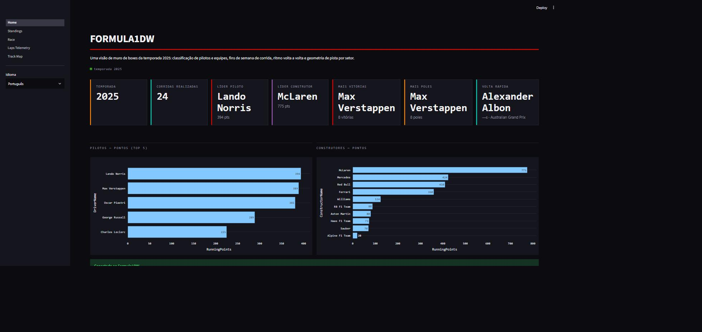
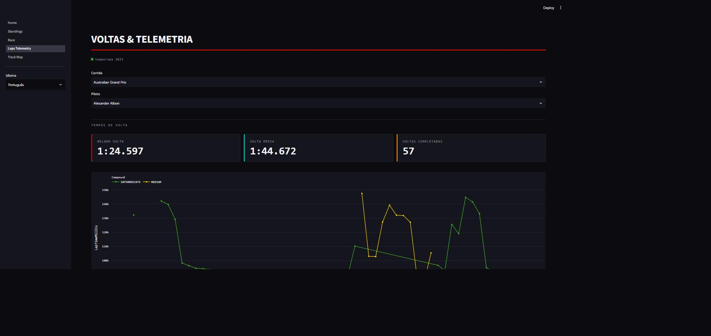
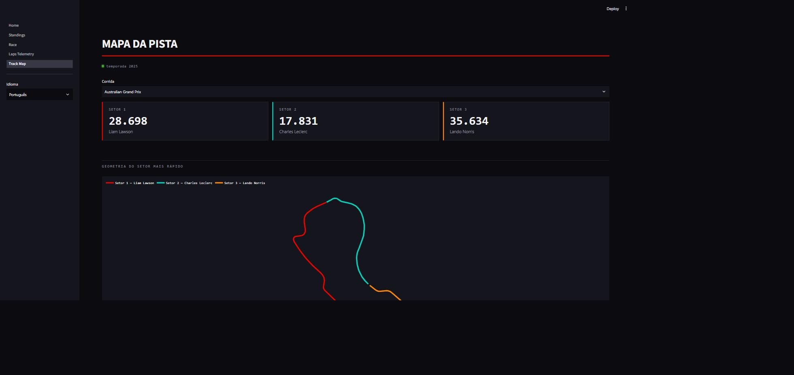

# Formula1DW — Pit-Wall Dashboard

Data warehouse + dashboard da temporada de F1 2025: pipeline ETL de verdade
(não é CSV estático), banco em estrela no SQL Server, e um painel Streamlit
com identidade visual de telão de muro de boxes.



## O que é

Extrai dados reais da F1 — resultados, classificação, tempos de volta,
pit stops, clima e telemetria — via **Jolpica-F1** (sucessor do Ergast API)
e **FastF1**, carrega num data warehouse em estrela (SQL Server) e expõe
tudo num dashboard Streamlit com 5 páginas, PT/EN.

```
Jolpica-F1 / FastF1  →  ETL (Python)  →  SQL Server (star schema)
                                              │
                                       mart views (SQL)
                                              │
                                 snapshot .sqlite (scripts/export_sqlite.py)
                                              │
                                    Streamlit dashboard
```

O dashboard lê de um snapshot `.sqlite` já incluído no repo — roda direto,
sem precisar de SQL Server no ar.

## Páginas do dashboard

**Home** — visão geral da temporada: líder do campeonato (piloto e
construtor), mais vitórias, mais poles, volta mais rápida, e os top 5
de pontos em piloto/construtor.

**Standings** — evolução de pontos rodada a rodada (gráfico de linha) pra
todos os pilotos e construtores, com líder atual e diferença pro 2º lugar.

**Race** — resultado de uma corrida específica: grid de largada, posição
final, pontos, pit stops e clima da sessão.

**Laps & Telemetry** — tempos de volta por composto de pneu, melhor volta,
volta média, e telemetria detalhada (velocidade, marcha, acelerador) de
uma volta escolhida.



**Track Map** — geometria da pista colorida pelo piloto mais rápido em
cada um dos 3 setores oficiais, mais um ranking de melhor volta da
corrida selecionada.



## Stack

- **Extração**: `fastf1` (Ergast/Jolpica + telemetria FastF1)
- **Banco**: SQL Server — star schema (`dw.Dim*` / `dw.Fact*`) + mart views
- **ETL**: Python, `pandas` + `SQLAlchemy`/`pyodbc`, checkpoint idempotente
- **Dashboard**: `streamlit` + `plotly`

## Como rodar o dashboard

```bash
pip install -r requirements.txt
streamlit run dashboard/Home.py
```

Abre em `http://localhost:8501`. Usa o snapshot `dashboard/data/formula1dw.sqlite`
já commitado — não precisa de banco rodando.

## Rodar o pipeline ETL completo

Requer SQL Server local (`Formula1DW`, ver `database/`) e ODBC Driver 18.

```bash
pip install -r requirements.txt
python -m etl.run                          # checkpoint mode
python -m etl.telemetry --season 2025 --round 1 --driver VER   # telemetria sob demanda
python -m scripts.export_sqlite            # regenera o snapshot do dashboard
```

Detalhes em `etl/README.md` e `database/README.md`.
